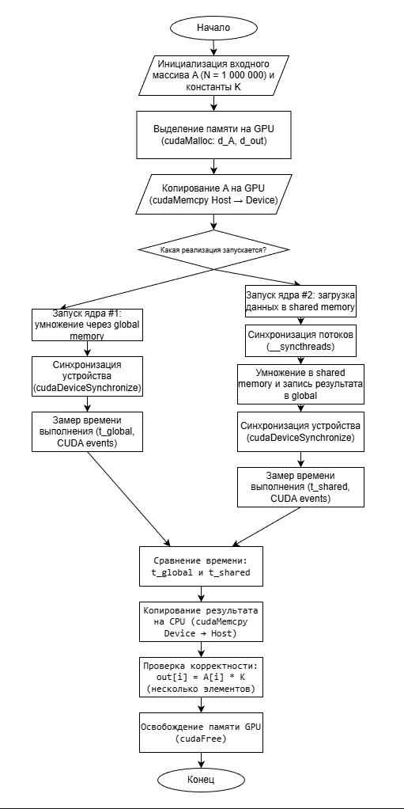
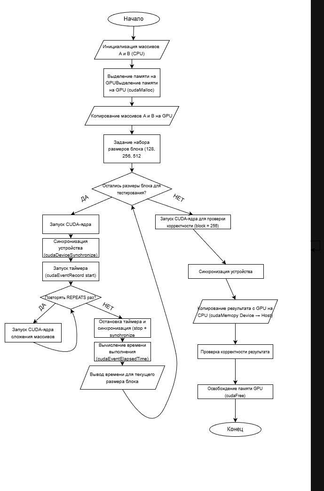
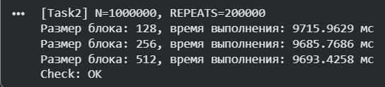
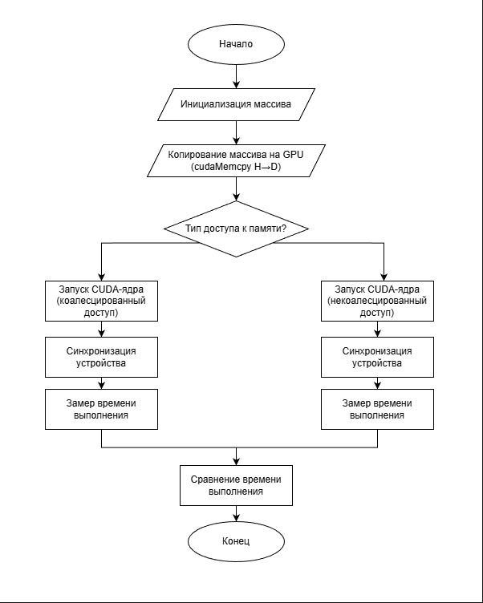
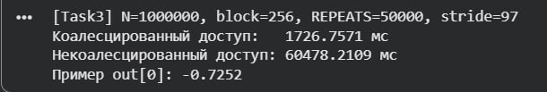

# Assignment3

Репозиторий содержит решения задания Assignment 3, посвящённого изучению архитектуры GPU и основ оптимизации CUDA-программ.
В рамках работы были разработаны и проанализированы CUDA-приложения, демонстрирующие влияние различных факторов на производительность вычислений на графическом процессоре.


## Задание 1 (25 баллов)
В данном задании реализована CUDA-программа, выполняющая поэлементное умножение элементов массива на заданную константу.
Были разработаны два варианта реализации:
– с использованием только глобальной памяти;
– с использованием разделяемой (shared) памяти.
Для массива размером 1 000 000 элементов выполнено сравнение времени выполнения обеих реализаций.

**Блок-схема**

 

**Компиляция**

```
nvcc -O3 task1.cu -o task1 --generate-code=arch=compute_75,code=sm_75
./task1
```

**Результат**

 

 ----
## Задание 2 (25 баллов)
Исследуется влияние размера блока потоков на производительность CUDA-программы.
В рамках работы реализовано поэлементное сложение двух массивов на GPU и выполнены измерения времени работы ядра при различных размерах блока потоков.
Сравнение производительности проведено для трёх конфигураций: 128, 256 и 512 потоков в блоке.

**Блок-схема**

 

**Компиляция**

```
nvcc -O3 task2.cu -o task2 --generate-code=arch=compute_75,code=sm_75
./task2
```

**Результат**

 

## Задание 3 (25 баллов)
В данном задании разработана CUDA-программа для обработки массива, позволяющая проанализировать влияние характера доступа к глобальной памяти на производительность вычислений.
Реализованы два варианта доступа: коалесцированный и некоалесцированный.
Для массива размером 1 000 000 элементов выполнено сравнение времени выполнения обеих реализаций.

**Блок-схема**

 

**Компиляция**

```
nvcc -O3 task3.cu -o task3 --generate-code=arch=compute_75,code=sm_75
./task3
```

**Результат**

 
